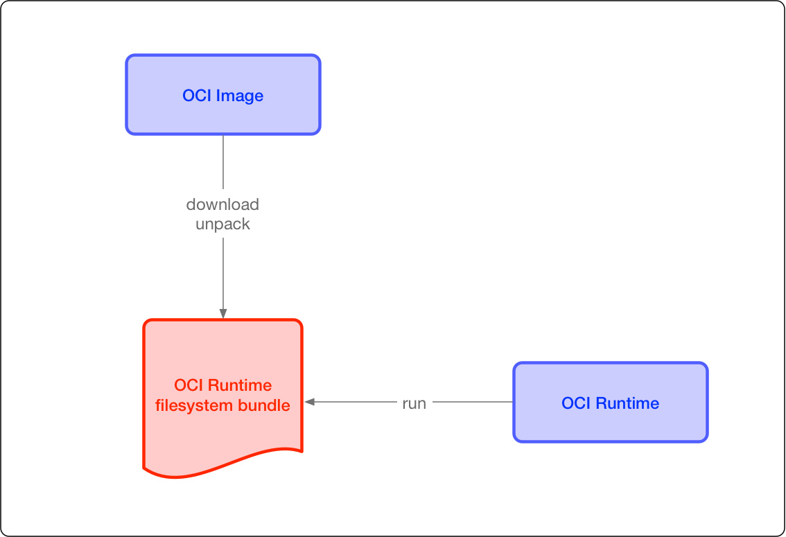

# docker简介

在我的其他文章中已经多次使用过docker这个工具,看过那些文章的同学应该已经充分理解了其便利性.

可以说docker是计算机领域近10年最伟大的工具都不过分,它的出现大大简化了开发到部署的流程,让不同的使用环境可以有相同的执行环境.

本文将系统的介绍这一跨时代的工具.

## docker解决的问题

我们在自己之前的博文中也已经介绍过一些运维工具,如[fabric用于批量部署](http://blog.hszofficial.site/introduce/2015/03/15/%E4%BD%BF%E7%94%A8Fabric%E5%81%9A%E6%89%B9%E9%87%8F%E9%83%A8%E7%BD%B2/),[supervisor用于自动重启服务,监控服务状态](http://blog.hszofficial.site/introduce/2015/02/19/%E4%BD%BF%E7%94%A8Supervisor%E5%81%9A%E6%9C%8D%E5%8A%A1%E7%9B%91%E6%8E%A7%E5%92%8C%E7%AE%A1%E7%90%86/).这些东西通常是针对的生产环境的单一问题.而docker解决的问题和他不同,可以认为docker是试图使用一套生态解决从开发到部署过程中的全部问题.docker解决的问题可以归结为如下几点:

1. 部署环境差异

    在传统的软件开发流程中开发和部署是割裂的--开发在开发环境,测试在测试环境,最终部署在生产环境.

    ![传统的软件][1]

    环境隔离本身是合理必要的,这样不同阶段的开发任务不会相互影响,可以提高效率.但这也带来了问题--不同环境的配置和执行环境会有差异,这就会出现一些因为这些差异引起的问题,比如缺少依赖/依赖版本不一致等.这是非常常见的问题.

    Docker解决了运行环境和配置问题,方便发布,也就方便做持续集成.因此在日益强调持续集成持续发布的今天,docker成为了基石.

2. 资源争抢

    我们都希望生产环境尽量充分的利用机器资源,因此我们不可能奢侈的让一台机器只执行一个程序,但如果一个程序超过我们预期的使用了机器的资源,甚至直接耗尽了机器的资源,那就会影响到同一机器上的其他程序,甚至造成不得不重启机器的恶性事件,直接影响业务造成经济损失.使用docker可以通过限制资源避免这一情况.

3. 执行环境交叉冲突

    因为我们为了最大化利用机器就会将多个软件部署在同一台机器上,由于软件的依赖往往不同,很容易就会出现软件A依赖版本0.1的库,软件B依赖版本0.2的库,如果库向下兼容还好说,如果不兼容那很容易就会A软件无法执行.

    各种编程语言的社区都或多或少的为避免依赖冲突提供解决方案.

    比如python中从开发调试测试到部署,有一系列简单好用的工具:

    + 开发使用标准库`venv`用于构造虚拟环境隔离依赖
    + 依赖管理使用`pip`
    + 批量部署使用`fabric`

    在js中默认就是使用虚拟环境,只需要通过git在目标机器上拉取仓库,并执行`npm install`就可以完美部署好执行环境;

    而如果是Go那就更加简单了,本地可以交叉编译目标平台的可执行文件,编译完成后直接放上去就可以执行.

4. 软件分发

    各种方式开发的软件往往有自己的分发渠道,比如python用pypi,node用npm,go写的程序直接分发对应平台的二进制文件等.但这也往往会受到平台影响.
    如果是脚本语言开发的软件还好,只要不使用C扩展一般都可以跨平台部署,但如果是编译语言开发的,那就必须要支持交叉编译才行.

从运维的角度来说docker的所谓一次编辑随处部署在多数情况下是多余的.那为什么还要用docker呢?

+ docker比所有的虚拟环境都底层,它只依赖于系统内核,因此更加不容易出问题
+ docker的使用方式是配置化的,这意味着可以将开发和运维分离,运维不需要知道要部署和维护的软件是如何开发的,运行需要什么参数,run就行了,借助一些可视化工具运维甚至都不用懂linux命令行操作(前提是它只是用docker而非维护和部署docker环境).
+ docker有专用的镜像仓库和镜像编译流程,可以交叉编译跨平台的镜像,做到一次编译处处部署.
+ docker由于本质上是一种轻量级的虚拟机技术,它可以配置每个容器的使用资源,这样可以更好的控制整个系统的资源分配.
+ docker天生为集群服务,当你的应用受众变大后它可以更容易的横向扩展

此外由于docker是客户端服务器形式的执行流程,因此天然对DevOps亲和,借助一些工具可以做到全程自动化部署.

## 容器技术

Linux Container(简称LXC)容器技术的诞生于2008年,是一种内核轻量级的操作系统层虚拟化技术,主要由Namespace和Cgroup两大机制来保证实现.Namespace用于做隔离,Cgroup则负责资源管理控制,比如进程组使用CPU/MEM的限制,进程组的优先级控制,进程组的挂起和恢复等等.docker就是基于LXC的一个工具.

docker创建的每个容器都是相互独立的沙盒(Sandbox)环境,并且不会污染宿主机的环境.

docker容器相当轻量,相当于一个略微复杂的进程,因此也不推荐把它当虚拟机使,里面放几个进程还用supervisor什么的做自动重启和监控.官方的推荐用法也是一个容器就只执行一个进程.

容器技术的好处是

1. 极其轻量: 只打包了必要的Bin/Lib
2. 秒级部署: 根据镜像的不同,容器的部署大概在毫秒与秒之间(比虚拟机强很多)
3. 易于移植: 一次构建,随处部署
4. 弹性伸缩: Kubernetes、Swam、Mesos这类开源集群容器管理平台有着非常强大的弹性管理能力.

## 使用场景

Docker的不同部署方式有不同的适用场景.

通常情况下Docker比较适合没有部署高吞吐量需求的无状态服务.

## 需要的知识储备

本系列文章需要有如下知识储备:

+ 使用python构建简单http服务(可以看懂例子)
+ 了解yaml格式
+ linux命名行基础

## Docker体系的组成

docker体系的核心部件可以用下面一张图来概括


而Docker Daemon又可以用下面的图来概括:


除了核心部件外,都是非必须的组件,他们通常需要额外安装或者额外配置,总结如下:

| 组件              | 功能                                              | 解决的问题   | 启用方法                         |
| ----------------- | ------------------------------------------------- | ------------ | -------------------------------- |
| `Docker Desktop`  | 让windows/mac上借助虚拟机技术运行docker套件       | 跨平台       | 额外安装                         |
| `docker-compose`  | 使用yaml配置文件编排部署容器                      | 服务编排问题 | 额外安装                         |
| `网络API`         | 启用接口让远程机器可以调用本地docker              | 远程控制     | 修改配置                         |
| `docker swarm`    | 将多台宿主机组成集群统一调度资源                  | 集群化       | 使用命令初始化                   |
| 各种特化`runtime` | 为docker提供额外能力和一些与默认runtime不同的行为 | 特殊用途     | 安装好后执行run命令时指定runtime |

在这之外还有一些比较主流的第三方工具可以作为额外扩展,这类工具一般都需要额外安装:

| 组件                  | 功能                             | 解决的问题 |
| --------------------- | -------------------------------- | ---------- |
| `kubernetes`俗称`k8s` | 将多台宿主机组成集群统一调度资源 | 集群化     |
| `portainer`           | 管理与之相连的docker环境         | 可视化     |
| `harbor`              | 可视化的管理存储镜像             | 可视化     |

## Docker的使用流程

docker基本上有3个核心概念

+ `镜像`类似虚拟机的快照,用于持久化执行环境和程序
+ `镜像仓库`,用于保存和分发镜像的公共空间.
+ `容器`类似从一个虚拟机的快照中创建虚拟机,用于执行镜像中的程序

docker的使用流程也是分裂为3个部分.即:

+ 构造镜像
+ 分发镜像
+ 利用镜像执行容器

因此天然的,开发和部署被分隔开了,在现代的DevOps体系下通常构造镜像的工作会由开发人员执行;编排镜像的工作则会由项目主管进行;而部署操作则会交给CI/CD工具.

### OCI

很多人可能觉得docker已经成为了容器技术的事实标准,因此我们以它作为标准问题就解决了.实际上情况比这个复杂

1. 容器技术本质上是linux内核的一个扩展,它并不是docker自己实现的
2. 容器作为一项相当底层的技术会构成其他技术的基石,如果docker版本一变接口一变上层的技术就需要变那就完蛋了.

因此docker,coreos以及其他容器相关公司在2015年创立了OCI(Open Container Initiative)标准用于确定接口,以便让容器技术有足够的可扩展性.

目前OCI主要有两个标准文档:

+ 容器运行时标准(runtime spec)
+ 容器镜像标准(image spec)

OCI规定了容器技术的基本框架如下图:



而docker现在也是在上述框架内的一种实现.换言之如果有一天你不打算用Docker了而是用其他的容器技术,那它只要满足OCI标准,你就还是会使用相同的工作流.

### Docker使用过程中的问题

在构造镜像部分,主要要解决的问题有:

+ 跨平台跨指令集问题
+ 镜像的存储和维护问题
+ 镜像的分发问题
+ 镜像的安全问题

在利用镜像执行容器部分,主要要解决的是容器的管理问题,主要包括:

+ 网络管理问题
+ 数据管理问题
+ 服务编排问题
+ 集群化部署问题

这些在docker体系下都有对应的解决方案.

但是还是那句话--没有银弹,docker可以解决很多问题,但不是万能的.使用它总体来说在多数情况下是利大于弊的,但还是要具体问题具体分析.

## 克服使用docker的心理障碍

不少不了解的人使用docker会有顾虑,主要是如下几个方面,这边一一给出解答.

> docker太重了,会额外占用资源

这个顾虑不是全无道理,docker比起虚拟机确实相当轻量,但毕竟是虚拟化技术,会有额外资源消耗不可避免.你要明白一点,容器的功能不是docker提供的,相关技术都是Linux内核提供的.
docker只是一个容器的管理器而已.正因为这样,Docker不能离开Linux系统运行.损耗的话,理论上对CPU来说只有1% ~3%,内存也极小.损失基本只出现在I/O上,包括网络I/O和文件系统I/O.
这两者就要看不同的实现了.
物理机上直接对网卡hack可以达到几乎无损失的网络,其他网络方式除非是`--host`模式都会有不同程度的损失.也是看方案的,这块我们会在后文[Docker的Swarm集群]部分详细说明.

文件系统同样,不同的实现性能损失不同.但是对于99%的应用程序来说根本不需要考虑这个损失.即便是要考虑,结合docker体系对开发生产力的提升来说大多数场景下也是利大于弊的.

IBM有论文[An Updated Performance Comparison of Virtual Machines
and Linux Containers](https://domino.research.ibm.com/library/cyberdig.nsf/papers/0929052195DD819C85257D2300681E7B/$File/rc25482.pdf)对其已经做出了详细评测

> docker镜像/layout网络/log会占用大量硬盘资源

这个问题更多的时候是使用docker的方式出了问题,就像用刀叉的不能像用筷子的一样夹菜吃一样,用docker的服务器运维也不可能和裸机完全一样.

首先必须承认相比裸机,docker是需要额外的硬盘空间的,为了不影响宿主机的正常运行,我们最好将docker的目录迁移到非系统盘,一般常见的操作是使用链接.注意要将原有的数据迁移过去需要先停止docker的运行.我们以centos为例,将docker相关的数据迁移到`/data/docker`目录

```bash
systemctl stop docker
cd /data
mv /var/lib/docker /data/docker
ln -s /data/docker /var/lib/docker
systemctl restart docker
```

不同的资源节省硬盘资源的方式也是不一样的,我们一个一个来说.

1. 镜像

    镜像使用合理是不会占用大量额外硬盘的,因为[docker的镜像原理](https://docs.docker-cn.com/engine/userguide/storagedriver/imagesandcontainers/)是一层层的堆叠的,相同底层的镜像会复用同样的底层镜像.
    因此只要管理好底层镜像的依赖树就不会出现大量的额外硬盘占用问题.

    ![镜像的结构][2]

2. layout网络

    layout网络是docker swarm默认下最常规的网络类型,会损失大约50%的io性能,但是架不住功能强大,老实说不推荐生产环境使用.推荐使用host网络(几乎100%物理机性能)或者macvlan网络(90%物理机性能)代替

3. log

    docker默认会记录所有打印出来的log,我也更加推荐容器中log直接输出到stdout,但这样log就会不可控.比较推荐的方式是在执行容器时设置好log保存行为,我们使用`--log-opt max-size=10m`设置切割之前日志的最大大小,`--log-opt max-file=3`设置存在的最大日志文件数.
    这样如果切割日志会创建超过阈值的文件数,则会删除最旧的文件.

    但这并不解决log收集的问题,业界比较通用的方法是将log通过logstach收集后输送到kafka最终落库到hive,同时将近期数据存入elasticsearch方便查询分析.这个会在后续文章中介绍.

> 使用docker会需要学习很多额外的东西

那必须的,docker几乎是一个完全不同于传统的体系.但docker的核心内容并不多,也不需要一开始就什么都学,计算机领域只有能大幅提升生产力的工具才能活下来,docker的成功已经证明它的价值.
如果只是因为不想学新东西就放弃的话就白白错过了一个大幅提高生产力的好工具.

> docker不安全

能提出这个疑惑的人应该是比较有水平的.先说结论:docker本身默认情况下是相对安全的,尤其是你在容器中通过非特权用户运行进程时.

一般情况下对于小公司小项目来说,如果因为docker的安全性被黑客攻击了,你应该感到高兴,说明你的项目真的有价值让黑客愿意花心思黑.

使用docker当然不能避免原本裸机的安全性问题,但这不在本文的讨论范围内,docker的安全性大致可以分为两块:

1. docker服务体系的安全性
2. docker镜像的安全性

>> 增强docker服务体系安全性的措施

docker服务体系的安全性也可以认为是容器技术本身的安全性.Docker利用Namespace实现了6项隔离.看似完整,实际上依旧没有完全隔离Linux资源,比如`/proc,/sys,/dev/sd*`等目录未完全隔离,`SELinux,time,syslog`等所有现有Namespace之外的信息都未隔离.这是docker服务体系的一个安全性隐患,Docker在增强安全性上也可以做很多工作,大致包括下面几个方面:

1. Linux内核Capability能力限制

    Docker容器本质上就是一个进程,默认情况下Docker会删除必须的Capabilities外的所有Capabilities,可以在Linux手册页中看到完整的可用Capabilities列表.

    Docker支持为容器设置Capabilities,指定开放给容器的权限.这样在容器中的root用户比实际的root少很多权限(默认).
    这对于容器安全意义重大,因为在容器中我们经常会以root用户来运行,使用Capability限制后,容器中的root比真正的root用户权限少得多,这就意味着即使入侵者设法在容器内获取了root权限也难以做到严重破坏或获得主机root权限.

    Docker在0.6版本以后支持在启动参数中增加`--privileged`选项为容器开启超级权限支持将容器开启超级权限,使容器具有宿主机的root权限.
    当我们在`docker run`时指定了`--privileged`选项,Docker其实会完成两件事情:
    1. 获取系统root用户所有能力赋值给容器
    2. 扫描宿主机所有设备文件挂载到容器内

    使用`--privileged`参数授权给容器的权限太多,所以需要谨慎使用.如果需要挂载某个特定的设备可以通过`--device`方式,只挂载需要使用的设备到容器中,而不是把宿主机的全部设备挂载到容器上.例如为容器内挂载宿主机声卡:`docker run --device=/dev/snd:/dev/snd`,此外也可以通过`--add-cap`和`--drop-cap`这两个参数来对容器的能力进行调整,以最大限度地保证容器使用的安全.例如给容器增加一个修改系统时间的命令:`docker run --cap-drop ALL --cap-add SYS_TIME ...`,我们也可以在宿主机上使用`getpcaps <PID>`查看容器进程的能力授权情况.

2. 镜像签名机制

    当我们执行`docker pull`镜像的时候,镜像仓库在验证完用户身份后会先返回一个`manifest.json`文件,其中包含了镜像名称,tag,所有layer层SHA256值,还有镜像的签名信息.然后`docker daemon`会并行的下载这些layer层文件.Docker 1.8以后提供了一个数字签名机制——content trust来验证官方仓库镜像的来源和完整性.这项功能默认是关闭的,需要在push的机器上设置环境变量`DOCKER_CONTENT_TRUST=11`才能开启.简单来说就是镜像制作者制作镜像时可以选择对镜像标签(tag)进行签名或者不签名,当pull镜像时就可以通过这个签名进行校验,如果一致则认为数据源可靠并下载镜像.

    如果在开启了content trust功能的机器上pull镜像时希望不进行验证,可以在pull命令后面加上参数`--disable-content-trust`来取消这个限制.

3. Apparmor的MAC访问控制

    AppArmor是Linux安全模块,可以将进程的权限与进程capabilities能力联系在了一起,实现对进程的强制性访问控制(MAC).这是Docker官方推荐的方式.在Docker中,我们可以使用Apparmor来限制用户只能执行某些特定命令,限制容器网络,文件读写权限等功能.

    Docker自动为容器生成并加载名为`docker-default`的默认配置文件.在Docker 1.13.0和更高版本中Docker二进制文件在`tmpfs`中生成该配置文件,然后将其加载到内核中;在早于1.13.0的Docker版本上此配置文件将在`/etc/apparmor.d/docker`中生成.`docker-default`配置文件是运行容器的默认配置文件.它具有适度的保护性同时提供广泛的应用兼容性.

    默认运行容器时会使用`docker-default`策略,除非通过`security-opt`选项覆盖.以`nginx`部署为例: 

    + 我们可以人为的定义个自定义的Apparmor配置在`/etc/apparmor.d/containers/docker-nginx`,配置如下:

    ```txt
    #include <tunables/global>

    profile docker-nginx flags=(attach_disconnected,mediate_deleted) {
    #include <abstractions/base>
    ...
    deny network raw,
    ...
    deny /bin/** wl,
    deny /root/** wl,
    deny /bin/sh mrwklx,
    deny /bin/dash mrwklx,
    deny /usr/bin/top mrwklx,
    ...
    } 
    ```

    这个配置会禁止容器访问外网,并且上面几个路径的访问权限也将受限.

    + 然后使用`apparmor_parser`加载这个配置

    ```bash
    sudo apparmor_parser -r -W /etc/apparmor.d/containers/docker-nginx
    ```

    + 然后执行容器时使用这个配置:

    ```bash
    docker run --security-opt "apparmor=docker-nginx" -p 80:80 -d --name apparmor-nginx nginx
    ```

4. Seccomp系统调用过滤

    Seccomp是Linux kernel从2.6.23版本开始所支持的一种安全机制,可用于限制进程能够调用的系统调用(system call)的范围.在Linux系统里,大量的系统调用(systemcall)是直接暴露给用户态程序的,但并不是所有的系统调用都被需要,而且不安全的代码滥用系统调用会对系统造成安全威胁.通过Seccomp,我们限制程序使用某些系统调用,这样可以减少系统的暴露面,同时使程序进入一种"安全"的状态.每个进程进行系统调用(system call)时,kernel都会检查对应的白名单以确认该进程是否有权限使用这个系统调用.

    从Docker 1.10版本开始Docker安全特性中增加了对Seccomp的支持.Docker提供的默认Seccomp配置文件已经禁用了大约44个超过300+的系统调用,满足大多数容器的系统调用诉求.使用Seccomp的前提是Docker构建时已包含了Seccomp,并且宿主机内核中的`CONFIG_SECCOMP`已开启.可使用命令

    ```bash
    cat /boot/config-`uname -r` | grep CONFIG_SECCOMP=
    ```

    检查内核是否支持Seccomp.

    运行容器时,如果没有特殊需求建议使用默认的Seccomp配置,如果需要修改配置可以通过`--security-opt`选项覆盖容器.例如:

    ```bash
    docker run --rm -it --security-opt seccomp=/path/to/seccomp/profile.json hello-seccomp
    ```

    其中的`/path/to/seccomp/profile.json`指向的是Seccomp配置文件,这个配置相当于是一份白名单,如果里面没有内容就会禁用所有的系统调用.

5. User Namespace隔离(不推荐)

    linux命名空间(Namespace)为运行中的进程提供了隔离,限制他们对系统资源的访问,而进程没有意识到这些限制.为防止容器内的特权升级攻击的最佳方法是将容器的应用程序配置为非特权用户运行,对于其进程必须作为容器中的root用户运行的容器,可以将此用户重新映射到Docker主机上权限较低的用户.映射的用户被分配了一系列UID,这些UID在命名空间内作为从0到65536的普通UID运行,但在主机上没有特权.

    重新映射由两个文件处理:`/etc/subuid`和`/etc/subgid`,其中前者关注用户ID范围,后者关注用户组ID范围.例如如下`/etc/subuid`中的条目:

    ```txt
    testuser:231072:65536
    ```

    这意味着testuser将从231072开始,在后面的65536个整数中按顺序为用户分配一个ID.例如命名空间中的UID 231072映射到容器中的UID 0(容器中的root),UID 231073映射为宿主机的UID 1,依此类推.

    如果某个进程尝试提升特权到命名空间外部,则该进程将作为主机上无特权的高数字UID运行,该UID甚至不映射到真实用户,这意味着该进程完全没有主机系统的权限.

    在Docker 1.10以后可以通过在docker的服务程序`dockerd`启动参数中指定`userns-remap`来启用这个功能,

6. SELinux(不推荐)
    SELinux主要提供了强制访问控制(MAC),即不再是仅依据进程的所有者与文件资源的rwx权限来决定有无访问能力.能在攻击者实施了容器突破攻击后增加一层壁垒.Docker提供了对SELinux的支持.

7. pid-limits
    在说pid-limits前,需要说一下什么是fork炸弹(fork bomb),fork炸弹就是以极快的速度创建大量进程,并以此消耗系统分配予进程的可用空间使进程表饱和,从而使系统无法运行新程序.说起进程数限制,大家可能都知道ulimit的nproc这个配置,nproc是存在坑的,与其他ulimit选项不同的是,nproc是一个以用户为管理单位的设置选项,即他调节的是属于一个用户UID的最大进程数之和.Docker从1.10以后,支持为容器指定`--pids-limit`限制容器内进程数,使用其可以限制容器内进程数.

8. 使用第三方内核安全特性工具

    在容器生态的周围,还有很多工具可以为容器安全性提供支持.

    + 可以使用[docker-bench-security](https://github.com/docker/docker-bench-security)检查你的Docker运行环境,如Docker daemon配置,宿主机配置
    + 使用[Sysdig Falco](https://sysdig.com/opensource/falco)可以监视容器的行为,检测容器中是否有异常活动.

>> 增强docker镜像的安全性

docker本身的安全性通常不需要开发人员关心,默认配置已经相当安全,但镜像的安全性却需要额外留意.根据绿盟2018年3月的研究显示,目前Docker Hub上的镜像76%都存在漏洞.其研究人员拉取了Docker Hub上公开热门镜像中的前十页镜像,对其使用Docker镜像安全扫描工具[Clair](https://github.com/quay/clair)进行了CVE扫描统计,结果显示在一百多个镜像中没有漏洞的只占到24%,包含高危漏洞的占到67%.很多我们经常使用的镜像都包含在其中,如:httpd,Nginx,MySQL等等.

docker镜像攻击安全漏洞主要就3种--Dockerfiles攻击,Docker compose攻击,Docker镜像自动化攻击.

1. Dockerfiles攻击(针对镜像本身)
   在Dockerfiles中写入恶意命令,如反弹Shell或者添加恶意用户等,或者引入存在漏洞的应用,如使用存在远程命令执行漏洞的Strusts2

2. Docker compose攻击(针对部署镜像)
   类似的,编写好存在恶意命令或者漏洞组件的Docker compose文件,一旦客户端Build完镜像,启动容器,就会执行攻击命令或暴露漏洞组件.

3. Docker镜像自动化攻击(针对镜像仓库)

    Docker镜像自动化渗透工具Dockerscan可扫描网段或者目标识别是否为Docker Registry,也支持对Docker Registry操作镜像,更支持修改镜像,将木马植入正常镜像中,当用户运行该镜像时,攻击者就会接收到反弹出的Shell,从而达到控制服务器的目的.

如何防范这些攻击呢,一个最简单通用的方式是使用[harbor](https://github.com/goharbor/harbor)做为镜像仓库,利用其中自带的镜像扫描工具做安全性检查

> docker无法利用gpu资源

能问这个问题的一定是有高性能计算需求的人.实际上这个说法并不准确,docker可以利用gpu资源,只是只支持英伟达cuda体系的gpu.

docker从19.03开始已将NVIDIA GPU作为设备本地支持.

目前支持的os环境为linux和windows,但两个操作系统有很大差别

>> linux

linux是docker官方支持的方式,毕竟docker是建立在linux上的工具.要docker使用cuda需要几个依赖:

+ `nvidia驱动`

    只有安装了nvidia驱动,宿主机才能识别出显卡.要检查是否安装了驱动,可以使用命令`lspci -vv | grep -i nvidia`查看是否安装好了驱动.
+ `cuda`

    一般情况下容器中的cuda都依赖宿主机的cuda,所以请在宿主机安装并设置好cuda.使用命令`nvcc -V`检查

+ [NVIDIA Container Runtime](https://github.com/NVIDIA/nvidia-container-runtime/)

    前面的部分和一般的构建深度学习环境时的操作基本一致,这个则是docker可以使用gpu的关键.


用法是在run命令中加入flag`--gpus`,例如`--gpus device=7`,`--gpus all`.

除此之外,nvidia提供了一个基础镜像,无需宿主机安装cuda,镜像名类似nvidia/cuda-9.0-base,nvidia/cuda-10.0-base,但是需要安装两个工具NVIDIA Container Toolkit和nvidia-container-runtime和一些设置.

>> windows

windows上的docker也是通过v-hyper虚拟机实现的,而对gpu的支持也是由微软提供的方案.这个方案依赖如下:

+ 操作系统为`Windows Server 2019`或者`Windows 10, version 1809以上`
+ 容器镜像必须基于[mcr.microsoft.com/windows:1809或更新的版本](https://hub.docker.com/_/microsoft-windows)
+ docker 版本高于19.03
+ gpu驱动版本高于WDDM 2.5,驱动版本可以在`DirectX Diagnostic Tool(dxdiag.exe)->Display->Diver Model`中查看版本
+ `Containers feature`必须开启,在`windows Features->Containers`
+ 容器必须以进程隔离模式运行,目前不支持Hyper-V隔离模式

用法是在run命令中加入flag`--isolation process`和`--device`,例如`docker run --isolation process --device class/5B45201D-F2F2-4F3B-85BB-30FF1F953599 winml-runner`

关于如何让容器使用gpu资源,我会在后续的文章中介绍

[1]: IMGS/tradictional_work_process.webp
[2]: IMGS/镜像的结构.webp