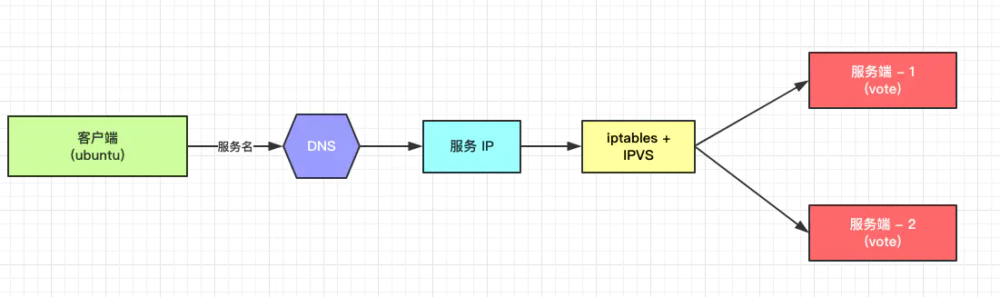
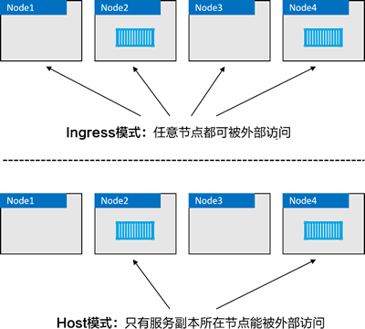
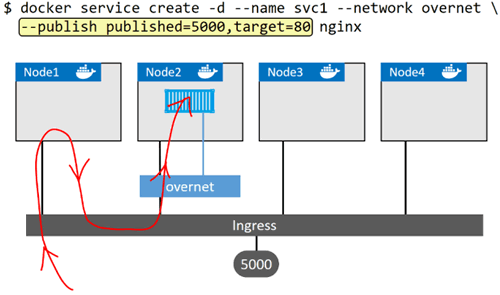
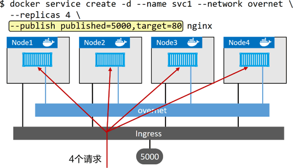

# Swarm集群的网络设置

Swarm集群的网络设置一般是3种:

+ overlay网络
+ host网络
+ macvlan网络

macvlan网路需要每个实例指定ip因此非常的不好用,用它的话不如直接上k8s了.这里也就不介绍了.本文将只介绍前两种.

网络设置主要分为两块:

1. 集群内容器间相互访问
2. 集群外访问集群内提供的服务

我们先从最简单的host网络开始

## host网络

一种手动档的网络配置方式是host网络,它的性能损失是最小的,因为它本质上就是用的宿主机的网络.这种模式下无法做端口映射,因为容器中的端口会直接暴露给宿主机.而在容器中我们可以直接获取到宿主机的网络信息(ip,mac地址等)

需要注意使用host网络和在单机中不同,`network_mode`字段在swarm中是无效的.我们需要配置挂载swarm上默认给的名为`host`的network才可以使用宿主机网络.

一个典型的host网络配置的`docker-compse`文件如下:

```yml
version: "3.7"
services:
  example_go_grpc_grpc_service1:
    image: hsz/example-go-grpc:0.0.2
    environment:
      EXAMPLE_GO_GRPC_ADDRESS: "0.0.0.0:500"
    deploy:
      mode: global
    networks:
      - mynetwork

networks:
  mynetwork:
    external: true
    name: host
```

在上面的例子中我们将服务挂载到了`host`网络上,这样服务就是使用的host网络部署的了.使用host网络的注意点有:

+ 不要再申明`ports`,host网络无法做端口映射.容器中开启了什么端口就会在宿主机中绑定什么端口
+ 部署时只能使用`global`模式,否则会因为端口冲突无法部署.

使用host网络也就意味着不存在所谓集群内集群外的概念了.左右的访问都是集群外访问.

host网络的优缺点都非常明显.优点就是性能,毕竟就是使用的宿主机网络,缺点就是管理的复杂度,因为它在管理方面基本就只有批量部署的能力了.

host网络要用好相当于要将服务注册服务发现以及负载均衡挂到集群之外,这对于小规模集群不是问题,但如果集群规模过大服务过多就会很难维护.

## overlay网络

overlay网络是Swarm的默认网络形式.它是一个全功能的虚拟网络,自带服务注册,服务发现,负载均衡.

部署服务的时候我们可以使用`deploy.endpoint_mode`选择overlay网络的负载均衡器,它有两种模式:

1. vip(虚拟ip)模式,
2. dnsrr(dns轮询)模式

### vip模式

vip(虚拟ip)模式,这种模式在docker内部将同一个service下的所有容器的ip都聚合为一个虚拟ip,当docker内部其他服务使用service的名字作为hostname访问它时,访问方将会获得这个虚拟ip,而这个虚拟ip会负责在同一service下的所有容器种分发请求流量.这种模式可以使用`ports`开放端口给外部使用.



vip模式的优点是无论服务是否伸缩,其他容器访问它的ip都是一样的.

#### 开放端口的模式

`ports`可以使用`ports[i].mode`设置开放端口的模式.有两种模式:

> `host`模式,一旦开放后服务只能通过运行服务副本的节点来访问,且只由宿主机上的实例处理,docker相当于对外只做一层端口映射.

> `ingress`模式(默认),使用`Routing mesh`管理外部访问的流量.一旦开放后可以保证从swarm集群内任一节点(即使没有运行服务的副本)都能访问该服务,外部访问会.



在`ingress`模式下外部访问服务的请求会像下图这样走



构造`Routing mesh`的是`ingress`层,它负责导流,端口映射,和负载均衡.一旦有请求过来`ingress`层会将它们导给不同的的容器处理.



host模式绕过了ingress层在节点间的中转直接访问服务,因此一般来说host模式性能会比ingress模式好些,但问题也有,就是外部必须知道哪些节点上有部署服务,因此一般host模式的overlay网络都是配合global模式的部署方式使用的.

### dnsrr模式

dnsrr(dns轮询)模式,这种模式在docker内部将会启用一个dns服务器将service的名字和所有容器的内部ip绑定,当docker内部其他服务使用service的名字作为hostname访问它时,访问方将会以轮询的方式返回一个容器的ip.这种模式下无法暴露出端口也无法让外部直接访问到服务.必须通过一个docker内部部署的反向代理服务来提供外网访问.

这种方式由于没有了vip层所以性能会比vip模式好一些.但我们就不得不自己搭一层反向代理用于暴露端口给外部使用了

## 网络性能测试

这个部分我们使用3台8g版本树莓派4b构建warm集群.一台2015款macbook air作为外部机器来做这个实验,外部可访问的位置固定为ResPiNode1的5000端口

我们依然用之前做的helloword服务模拟下真实情况下的性能损失

| 模式            | proxy模式           | 服务实例数 | 内网 qps | 外网qps |
| --------------- | ------------------- | ---------- | -------- | ------- |
| `vip`+`ingress` | ---                 | 3          | ---      | ---     |
| `vip`+`host`    | `nginx in host net` | 3          | ---      | ---     |
| `dnsrr`         | `vip`+`ingress`     | 3          | ---      | ---     |
| `dnsrr`         | `vip`+`host`        | 3          | ---      | ---     |
| `dnsrr`         | `nginx in host net` | 3          | ---      | ---     |
| `host net`      | `nginx in host net` | 3          | ---      | ---     |

