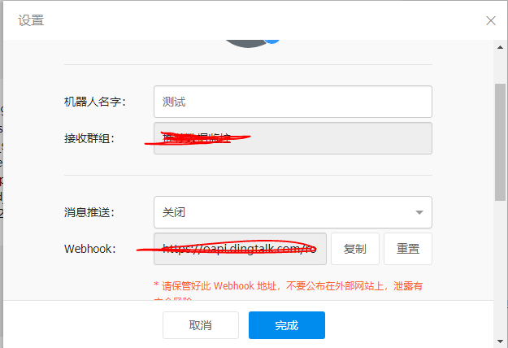
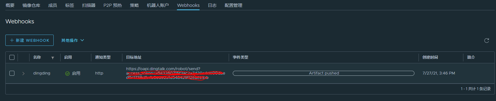

# CI/CD与Docker

CI/CD几乎是现代软件工程的标配,我们可以通过定义任务管道自动的将测试,校验,打包,部署完成.而且这些是非侵入式的,这就让开发和运维解耦了.开发人员只需要写好程序,其他工作将交给程序自动完成.

本文将以jenkins作为CI/CD工具,借助gitea作为代码仓库,配合harbor以及portainer的api来实现完整的CI/CD管道.不了解这两个工具的朋友可以看我博客中的[使用Github开始你的开源生涯系列文章](https://blog.hszofficial.site/series/%E4%BD%BF%E7%94%A8Github%E5%BC%80%E5%A7%8B%E4%BD%A0%E7%9A%84%E5%BC%80%E6%BA%90%E7%94%9F%E6%B6%AF/).

本文也是接在这系列文章之后的内容,毕竟现今的CI/CD几乎docker已经不可能缺席了.

## Docker Swarm体系下的CI/CD管道

在Docker Swarm体系下我们的CI/CD管道可以分为4步:

+ CI部分
  1. 代码风格(静态类型)校验
  2. 单元测试
  3. 镜像打包
+ CD部分
  1. 镜像部署

这一系列文章中我们已经可以用其中例子依葫芦画瓢完成CI部分的1,2两步了,剩下镜像打包和镜像部署我们则会在本文中介绍.

本文将在gitea和github上创建项目`docker-swarm_pipline_test`,用之前[golang版本hellodocker](https://github.com/hsz1273327/TutorialForDocker/tree/example-image-build-opt-build-go)的代码做例子演示镜像创建和更新.创建项目`docker-swarm_pipline_test_deploy`用于负责部署
所以我们的CI/CD管道介绍也是分为两种环境--github+dockerhub的纯开放环境和gitea+harbor的纯封闭环境.

无论是哪种环境,我们都是借助git的push和pull request事件来触发CI/CD工具执行预设任务,而CD部分我们则依赖portainer提供的api.

我已经利用portainer的api构造了一个python的命令行工具[portainer_deploy_tool](https://github.com/Python-Tools/portainer_deploy_tool),后文中很多部署操作也会用到它.

## 镜像标签与版本管理

docker系体下镜像标签一版用于管理应用版本.但docker镜像标签的特点是同一个镜像可以有多个标签,因为实际上标签真的就是标签而已,镜像的唯一标识是一串hash字符串.针对这一特点,再结合git的常用工作流就有了不同的思路来管理容器使用的应用版本(工作流带来的路径依赖).但无论哪种方式,我的建议是镜像无论如何都要有明确的版本号,并且只给可以用于生产的镜像打`latest`标签.我们就针对`使用Git管理你的代码`一文中介绍的3种常见工作流来谈下在各自的工作流中怎么打标签

### [主干分支策略](https://blog.hszofficial.site/introduce/2020/10/31/%E4%BD%BF%E7%94%A8Git%E7%AE%A1%E7%90%86%E4%BD%A0%E7%9A%84%E4%BB%A3%E7%A0%81/#%E4%B8%BB%E5%B9%B2%E5%88%86%E6%94%AF%E7%AD%96%E7%95%A5trunk-baseddevelopment)及其变种的镜像标签管理

这种工作流的特点是`master`分支由于有频繁的merge而无法保证一直可用,`release-<大版本>`分支由于也会有从`master`分支合并进来的情况只能大概率保证可用.只有打tag留档的才能保证确实可用.因此我们可以用如下策略构造镜像

| 分支                 | 镜像标签命名             | 期望                                              | 管道主要步骤 |
| -------------------- | ------------------------ | ------------------------------------------------- | ------------ |
| `release-<大版本号>` | `release-<版本号>`标签   | 预发版环境可用,用于`端到端测试`和`消费者驱动测试` | CI/CD        |
| `maste`              | `dev-<版本号>`标签       | 允许不能使用,更多的用于本地`单元测试`和`服务测试` | CI           |
| 各种tag              | `<版本号>`及`latest`标签 | 线上环境确保可用                                  | CI/CD        |

### [GithubFlow](https://blog.hszofficial.site/introduce/2020/10/31/%E4%BD%BF%E7%94%A8Git%E7%AE%A1%E7%90%86%E4%BD%A0%E7%9A%84%E4%BB%A3%E7%A0%81/#githubflow)及其变种的镜像标签管理

这种工作流特点是通过`pull request`强制要求code review来确保合并进`master`来代码后可用,因此每次merge后就应该重新打包更新版本.这种工作流的镜像标签策略也是最简单的:

| 分支     | 镜像标签命名               | 期望             | 管道主要步骤 |
| -------- | -------------------------- | ---------------- | ------------ |
| `master` | `<commit号>`及`latest`标签 | 线上环境确保可用 | CI/CD        |

至于单元测试和服务测试使用的镜像,则应该由pull request的发起者自己构造,构造管道的主要步骤就是1,2,3三步,这主要是两种类型

1. 本地仓库的`feature`分支:使用分支名作为镜像标签名打包镜像
2. fork出去仓库的分支(通常是`master`分支):一般使用维护组织的名字作为镜像标签名

### [gitflow](https://blog.hszofficial.site/introduce/2020/10/31/%E4%BD%BF%E7%94%A8Git%E7%AE%A1%E7%90%86%E4%BD%A0%E7%9A%84%E4%BB%A3%E7%A0%81/#gitflow)及其变种的镜像标签管理

这种工作流中应用版本非常明确,分支角色也相当明确,可以看到`master`分支上永远都是可用版本;`release`分支上永远是预发布版本,通常也应该是可用版本;而`dev`分支则是用于merge各种特性和hotfix的分支,通常它的目的就是让应用可用,为了验证其可符合要求,我们也会给上面的节点打镜像,至于其他分支就没必要打镜像了.这样就非常明确了.

| 分支      | 镜像标签命名             | 期望                                              | 管道主要步骤 |
| --------- | ------------------------ | ------------------------------------------------- | ------------ |
| `master`  | `<版本号>`及`latest`标签 | 线上环境确保可用                                  | CI/CD        |
| `release` | `release-<版本号>`标签   | 预发版环境可用,用于`端到端测试`和`消费者驱动测试` | CI/CD        |
| `dev`     | `dev-<版本号>`标签       | 允许不能使用,更多的用于本地`单元测试`和`服务测试` | CI           |

## 镜像更新通知

很多时候开发和部署不会是同一个人,即便是同一个人我们也应该将镜像更新的消息通知到一些相关的人员.

如果你使用钉钉这类可以注册webhook的工具分发通知,那么可以直接使用镜像仓库的webhook功能.无论是docker hub 还是harbor都又webhook功能,可以在镜像被push上去后触发post调用,我们只需要将webhook地址存进去即可.

1. 创建webhook地址(以钉钉为例)
    
2. 在镜像仓库中注册webhook
    
    

如果没有钉钉这类可以注册webhook的工具,那么最常见的就是使用email分发更新通知了.

我们可以使用[diun](https://crazymax.dev/diun/)来实现.它可以监控swarm集群中service使用的镜像的更新情况.在swarm集群中我们这样部署:

```yaml
version: "3.8"

services:
  diun:
    image: crazymax/diun:latest
    command: serve
    volumes:
      - "diun-data:/data"
      - "/var/run/docker.sock:/var/run/docker.sock"
    environment:
      TZ: Asia/Shanghai
      LOG_LEVEL: info
      LOG_JSON: "true"
      DIUN_WATCH_WORKERS: 20 # 监控线程数
      DIUN_WATCH_SCHEDULE: "0 */6 * * *" # 每6小时检查一次
      DIUN_PROVIDERS_SWARM: "true"
      DIUN_NOTIF_MAIL_HOST: xxx
      DIUN_NOTIF_MAIL_PORT: xxx
      DIUN_NOTIF_MAIL_SSL: xxx
      DIUN_NOTIF_MAIL_INSECURESKIPVERIFY: xxx
      DIUN_NOTIF_MAIL_USERNAME: xxx
      DIUN_NOTIF_MAIL_PASSWORD: xxx
      DIUN_NOTIF_MAIL_FROM: xxx
      DIUN_NOTIF_MAIL_TO: xxx
    deploy:
      mode: replicated
      replicas: 1
      placement:
        constraints:
          - node.role == manager

volumes:
  diun-data:
```

diun除了支持email方式外还有好几种额外的通知方式,但使用镜像仓库的webhook方式可以及时广播通知,而diun只能轮询,从效率上来说第一种方式更好些.

## 部署镜像时的标签选择

一般是两种思路,这两种方式各有优缺点:

1. 永远只部署`latest`标签的镜像
    + 优点:
        + 是部署的stack可以不用改,每次原样update就好,非常适合借助webhook实现全自动的服务更新
    +缺点:
        + 镜像版本不是显式的,不够明确,这会让更新和回滚操作难以辨识是否成功
        + 更新会带来许多标签为`<none>`的虚悬镜像,需要定期使用`docker system prune -f`清理虚悬镜像

2. 部署时指定版本号的镜像
    + 优点:
        + 部署明确,利于观测更新和回滚操作
    + 缺点:
        + 更新无法体现到部署时的stack文件上.
        + 由于需要更新stack因此无法避免人工介入,发布的实时性不如第一种方式

我们的例子就简化下上面的工作流,只有两个分支:

+ master分支为只部署`latest`标签的方式,只打`latest`和8位git commit的hash值作标签

+ release分支为只部署特定版本(符合`^[0-9]{1,3}\.[0-9]{1,3}\.[0-9]{1,3}$`形式版本号)镜像的方式

## github+dockerhub的纯开放环境下的CI/CD方案

github+dockerhub环境下我们的思路是:

> 业务代码打包镜像

`github action`负责CI部分,它的目的就是在校验好没有问题后把镜像打包好发送给`dockerhub`

> 部署

`github action`负责CD部分,它的目的就是当项目更新后通过推送激活portainer中指定stack进行更新

> 仅重新拉取更新`latest`镜像

只部署`latest`标签的方式下我们可以在镜像更新后对服务进行更新,有两种方式实现

1. `dockerhub`负责通过webhook更新
2. 通过工具对其中注册的webhook进行更新

> 修改stack配置及更新镜像位指定版本

当需要修改stack中的配置比如修改环境变量,修改部署约束等,又或者要更换镜像的指定标签时,我们应该修改部署项目中的对应stack,然后推送直接更新stack.

### 准备工作

1. 在项目`docker-swarm_pipline_test`的`Settings->Secrets`中设置
    + `DOCKER_HUB_USER`
    + `DOCKER_HUB_PWD`
    + `PORTAINER_USER`
    + `PORTAINER_PWD`
    + `PORTAINER_BASE_URL`

2. 在项目`docker-swarm_pipline_test_deploy`的`Settings->Secrets`中设置
    + `PORTAINER_USER`
    + `PORTAINER_PWD`
    + `PORTAINER_BASE_URL`

这部分对应的仓库在<https://github.com/hsz1273327/docker-swarm_pipline_test>和<https://github.com/hsz1273327/docker-swarm_pipline_test_deploy>

### Github代码仓库CI/CD配置

我们准备两个配置文件`.github\workflows\docker-buildandpublish-master.yml`和`.github\workflows\docker-buildandpublish-release.yml`分别对应master和release分支.

他们的结构和主体部分是一致的,都分为如下步骤:

1. 准备步骤(`Prepare`),用于构造镜像名和标签对应的字符串

    + `master`

        ```yaml
        - name: Prepare
          id: prep
          run: |
            DOCKER_IMAGE=${{ secrets.DOCKER_HUB_USER }}/${GITHUB_REPOSITORY#*/}
            VERSION=latest
            SHORTREF=${GITHUB_SHA::8}

            TAGS="${DOCKER_IMAGE}:${VERSION},${DOCKER_IMAGE}:${SHORTREF}"

            # Set output parameters.
            echo ::set-output name=tags::${TAGS}
            echo ::set-output name=docker_image::${DOCKER_IMAGE}
        ```

    + `release`

        ```yaml
        - name: Prepare
          id: prep
          run: |
            DOCKER_IMAGE=${{ secrets.DOCKER_HUB_USER }}/${GITHUB_REPOSITORY#*/}
            VERSION=0.0.1

            TAGS="${DOCKER_IMAGE}:${VERSION},${DOCKER_IMAGE}:latest"

            # Set output parameters.
            echo ::set-output name=tags::${TAGS}
            echo ::set-output name=docker_image::${DOCKER_IMAGE}
        ```

2. 设置QEMU(`Set up QEMU`),用于提供多平台交叉编译的能力

    ```yaml
    - name: Set up QEMU
        uses: docker/setup-qemu-action@master
        with:
          platforms: all
    ```

3. 设置buildx(`Set up Docker Buildx`),用于提供buildx环境

    ```yaml
    - name: Set up Docker Buildx
        id: buildx
        uses: docker/setup-buildx-action@master
    ```

4. 登录dockerhub(`Login to DockerHub`)

    ```yaml
    - name: Login to DockerHub
        if: github.event_name != 'pull_request'
        uses: docker/login-action@v1
        with:
          username: ${{ secrets.DOCKER_HUB_USER }}
          password: ${{ secrets.DOCKER_HUB_PWD }}
    ```

5. 编译步骤(`Build`),用于使用buildx编译出镜像并推送到docker hub

    ```yaml
    - name: Build
        uses: docker/build-push-action@v2
        with:
          builder: ${{ steps.buildx.outputs.name }}
          context: .
          file: ./Dockerfile
          platforms: linux/amd64,linux/arm64
          push: true
          tags: ${{ steps.prep.outputs.tags }}
    ```

我们的CI配置可以参考如下:

```yaml
name: "build images for master"

on:
  push:
    branches: [master]
  pull_request:
    branches: [master]
jobs:
  docker-build:
    runs-on: ubuntu-latest
    steps:
      - name: Checkout
        uses: actions/checkout@v2

      - name: Prepare
        id: prep
        run: |
          DOCKER_IMAGE=${{ secrets.DOCKER_HUB_USER }}/${GITHUB_REPOSITORY#*/}
          VERSION=latest
          SHORTREF=${GITHUB_SHA::8}
          TAGS="${DOCKER_IMAGE}:${VERSION},${DOCKER_IMAGE}:${SHORTREF}"
          # Set output parameters.
          echo ::set-output name=tags::${TAGS}
          echo ::set-output name=docker_image::${DOCKER_IMAGE}
      - name: Set up QEMU
        uses: docker/setup-qemu-action@master
        with:
          platforms: all

      - name: Set up Docker Buildx
        id: buildx
        uses: docker/setup-buildx-action@master

      - name: Login to DockerHub
        if: github.event_name != 'pull_request'
        uses: docker/login-action@v1
        with:
          username: ${{ secrets.DOCKER_HUB_USER }}
          password: ${{ secrets.DOCKER_HUB_PWD }}

      - name: Build
        uses: docker/build-push-action@v2
        with:
          builder: ${{ steps.buildx.outputs.name }}
          context: .
          file: ./Dockerfile
          platforms: linux/amd64,linux/arm64
          push: true
          tags: ${{ steps.prep.outputs.tags }}
```

### Github部署仓库的配置

我们在部署仓库中通过github action调用`portainer_deploy_tool`

+ `deploy-master.yaml`

    ```yaml
    name: Depoy Stacks

    on:
      push:
        branches: [master]
      pull_request:
        branches: [master]

    jobs:
      deploy:
        runs-on: ubuntu-latest
        steps:
          - uses: actions/checkout@v2
          - name: Set up Python 3.8
            uses: actions/setup-python@v2
            with:
              python-version: 3.8
          - name: Install Dependence
            run: |
              python -m pip install portainer_deploy_tool
          - name: Run Update
            run: |
              python -m portainer_deploy_tool createorupdatestack \
              --base-url=${{ secrets.PORTAINER_BASE_URL }} \
              --username=${{ secrets.PORTAINER_USER }} \
              --password=${{ secrets.PORTAINER_PWD }} \
              --endpoints=6 \
              --repository-url=https://github.com/${{ github.repository }}
    ```

进一步的,我们可以通过分支管理不同的端点,只要复制上面的yaml然后改下分支改下endpoints就行了.

### 为latest标签的服务启动webhook

进入服务管理页面激活webhook,


然后去dockerhub注册webhook


这样当我们更新`docker-swarm_pipline_test`项目的master分支时,github action执行成功将镜像推送到docker hub时就会激活注册的webhook.服务就被更新了

## gitea+harbor的纯封闭环境下的CI/CD方案

harbor虽然也有webhook,但它并不能针对某个特定名字的镜像进行触发而是只能针对一个命名空间进行触发.我们也就无法通过它来自动更新使用`latest`标签镜像的服务了.
但我的工具`portainer_deploy_tool`可以来做这一步操作,只是它需要放在镜像打包完成后在CI的最后一步做执行.

### 准备工作

在jenkins的`Jenkins->Configure System(设置)->Global properties(全局属性)-Environment(环境变量)`位置添加键值对`HARBOR_HOSTNAME`和`PORTAINER_URL`,同时为portainer,harbor和你的gitea的登陆账号密码注册Credentials,

### 镜像打包

我们希望自动化打包可以使用buildx,打包跨平台的镜像,因此我们需要使用镜像[jdrouet/docker-with-buildx](https://hub.docker.com/r/jdrouet/docker-with-buildx),这个镜像是`docker:dind`的扩展.

下面是`Jenkinsfile`示例

```Jenkinsfile
pipeline {
  agent none
  environment {
    VERSION = '0.0.1'
    ARTIFACT_PLATFORMS = 'linux/amd64,linux/arm64'
    WEBHOOK_TOKENS = 'xxxx xxxxx xxxx'
  }
  stages {
    
    stage('BuildArtifact') {
      when {
        branch 'master'
      }
      agent {
        docker {
          image 'jdrouet/docker-with-buildx:latest'
        }
      }
      steps {
        echo '[BuildArtifact] buildx init'
        sh 'docker buildx create --use'
        echo '[BuildArtifact] login harbor'
        withCredentials([usernamePassword(credentialsId: 'xxxx', usernameVariable: 'OPS_USER',passwordVariable: 'OPS_PWD')]) {
            sh 'docker login -u "$OPS_USER" -p "$OPS_PWD" $HARBOR_HOSTNAME'
        }
        echo '[BuildArtifact] start build'
        sh 'GIT_REP=${GIT_URL#*9080/} && IMAGE_ARTIFACT=${GIT_REP%.*} && docker buildx build --platform $ARTIFACT_PLATFORMS  -t $HARBOR_HOSTNAME/$IMAGE_ARTIFACT:${GIT_COMMIT: 0:8} -t $HARBOR_HOSTNAME/$IMAGE_ARTIFACT:latest --push .'
        echo '[BuildArtifact] build done'
      }
    }

    stage('UpdateService') {
      when {
        branch 'master'
      }
      agent {
        docker {
          image 'python:3.8'
        }
      }
      steps {
        echo '[UpdateService] install requirements'
        sh 'python -m pip install -i https://pypi.tuna.tsinghua.edu.cn/simple portainer_deploy_tool'
        echo '[UpdateService] create or update'
        withCredentials([usernamePassword(credentialsId: 'xxxxx', usernameVariable: 'OPS_USER',passwordVariable: 'OPS_PWD')]) {
          sh '''
          python -m portainer_deploy_tool updateservicebywebhooks \
          --base-url=$PORTAINER_URL \
          --retry-max-times=3 \
          $WEBHOOK_TOKENS
          '''
        }
      }
    }

    stage('Release-BuildArtifact') {
      when {
        branch 'release'
      }
      agent {
        docker {
          image 'jdrouet/docker-with-buildx:latest'
        }
      }
      steps {
        echo '[Release-BuildArtifact] buildx init'
        sh 'docker buildx create --use'
        echo '[Release-BuildArtifact] login harbor'
        withCredentials([usernamePassword(credentialsId: '6fa9756d-8411-4193-bc9c-c3374314adda', usernameVariable: 'OPS_USER',passwordVariable: 'OPS_PWD')]) {
            sh 'docker login -u "$OPS_USER" -p "$OPS_PWD" $HARBOR_HOSTNAME'
        }
        echo '[Release-BuildArtifact] start build'
        sh 'GIT_REP=${GIT_URL#*9080/} && IMAGE_ARTIFACT=${GIT_REP%.*} && docker buildx build --platform $ARTIFACT_PLATFORMS  -t $HARBOR_HOSTNAME/$IMAGE_ARTIFACT:$VERSION -t $HARBOR_HOSTNAME/$IMAGE_ARTIFACT:latest --push .'
        echo '[Release-BuildArtifact] build done'
      }
    }
  }
}
```

注意:

1. jenkins中无法直接获得仓库的命名空间和仓库名,但可以通过环境变量`GIT_URL`拿到git仓库的地址,我们需要进行下处理将其转化为`命名空间/仓库名`作为镜像的名字
2. 如果没有`WEBHOOK_TOKENS`则会报错退出,所以如果还未部署服务且未注册webhook的token的镜像`UpdateService`这步会失败
3. 由于我的portainer,gitea,Jenkins和harbor使用的用户登陆信息都一样,我就可以只用`withCredentials`一次取出这个登陆信息

这样推送后就可以在镜像仓库中找到了,如果我们的镜像仓库还设置了自动扫面,那么扫描工作也是自动化的了.

### stack部署

在仓库`docker-swarm_pipline_test_deploy`中我们设置pipline如下:

```Jenkins
pipeline {
  agent none
  stages {
    stage('Deploy Stack') {
      when {
        branch 'master'
      }
      environment {
        ENDPOINTS = 6
      }
      agent {
        docker {
          image 'python:3.8'
        }
      }
      steps {
        echo '[Deploy Stack] install requirements'
        sh 'python -m pip install -i https://pypi.tuna.tsinghua.edu.cn/simple portainer_deploy_tool'
        echo '[Deploy Stack] create or update'
        withCredentials([usernamePassword(credentialsId: '6fa9756d-8411-4193-bc9c-c3374314adda', usernameVariable: 'OPS_USER',passwordVariable: 'OPS_PWD')]) {
          sh '''
          GIT_REP=${GIT_URL#*9080/} && \
          python -m portainer_deploy_tool createorupdatestack \
          --base-url=$PORTAINER_URL \
          --username=$OPS_USER \
          --password=$OPS_PWD \
          --repository-url=https://dev.hszofficial.site:9080/$GIT_REP \
          --repository-username=$OPS_USER \
          --repository-password=$OPS_PWD \
          --retry-max-times=3 \
          $ENDPOINTS
          '''
        }
      }
    }
  }
}
```

如果不同分支的ENDPOINTS不同我们可以为每个分支设置一个stage,改下环境变量即可