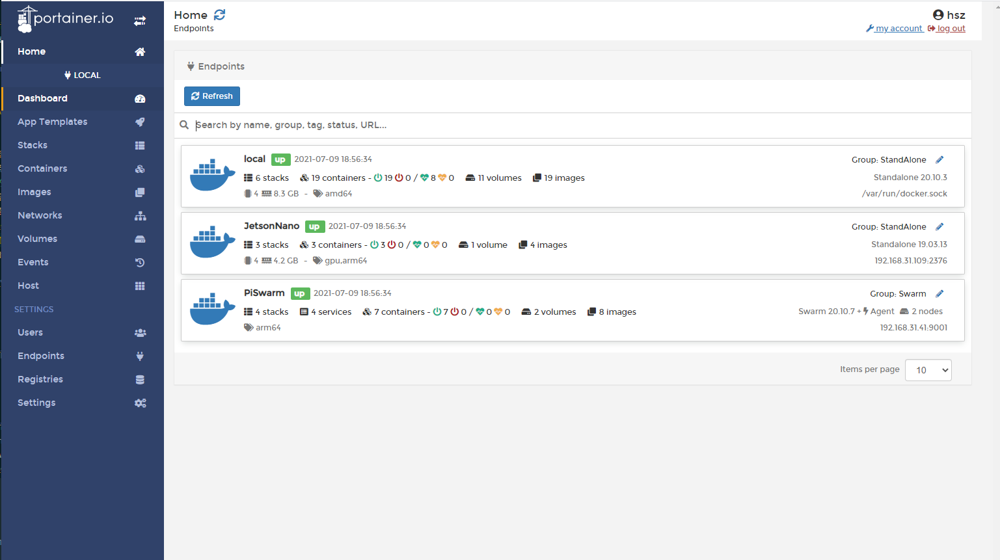
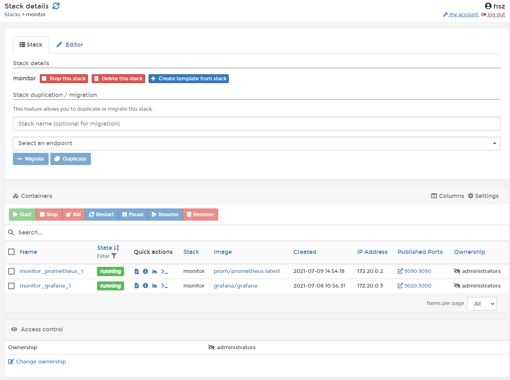
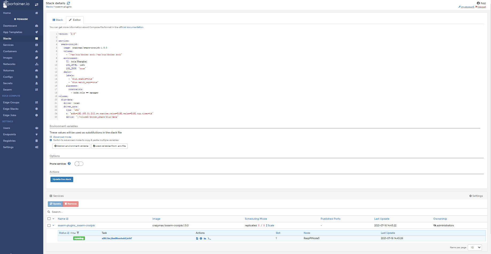
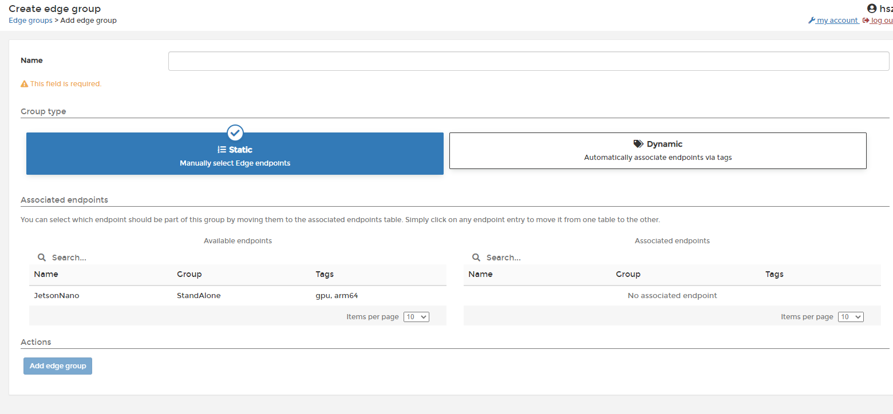
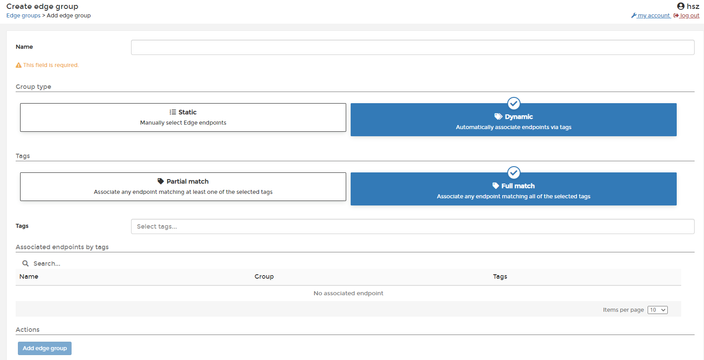
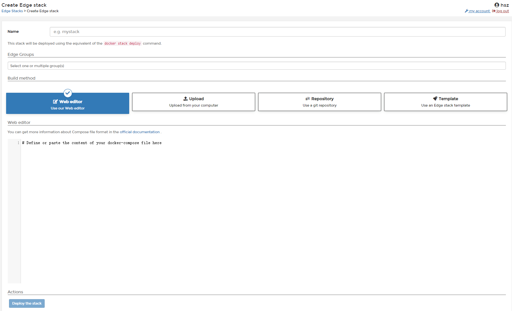
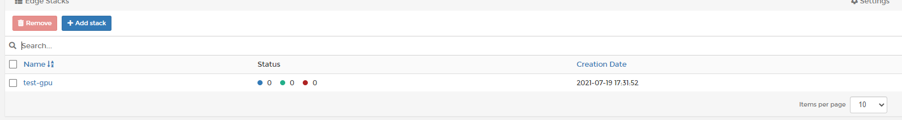
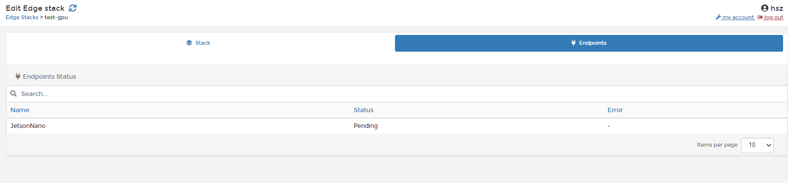
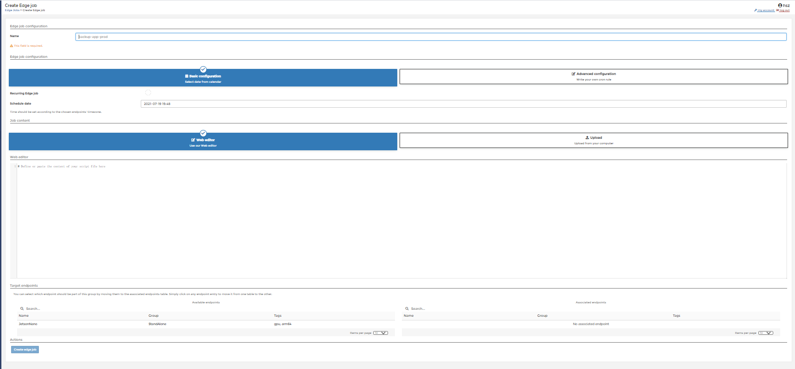

# 使用Portainer管理Docker环境

[Portainer](https://github.com/portainer/portainer)是一个专注于Docker环境管理的可视化开源工具.目前它支持管理的环境有:

+ 本地环境
+ 远程单机环境
+ Swarm环境
+ kubernetes环境

对kubernetes环境的支持是今年3月Portainer 2.0版本新增的特性.因此可能目前支持并不完善.但Portainer社区相当活跃,相信很快就会成熟.

需要注意,Portainer使用`docker-compose`部署容器使用的是自己fork的[libcompose](https://github.com/portainer/libcompose)实现的.也就是说它和docker官方的实现并不是同步的.
比如对GPU的支持目前Portainer还没有.如果有这种需求可能还是得手工去manager节点操作.

Portainer除了提供页面外也提供API供外部调用.由于是使用会过期的jwt作为权限令牌的所以相对也是比较安全的.

## 安装

portainer支持docker本地安装,docker swarm集群安装,以及k8s集群安装,具体的安装方式可以查看[官方安装文档](https://documentation.portainer.io/v2.0/deploy/linux/).
个人推荐docker本地模式安装,并且最好是放在一台相对稳定且与用于部署线上服务的机器隔离的机器上,并使用端点(Endpoint)来管理集群.

本地docker部署的方法是:

+ http

    ```bash
    docker volume create portainer_data
    docker run -d -p 8000:8000 -p 9000:9000 \
        --name=portainer --restart=always \
        -v /var/run/docker.sock:/var/run/docker.sock \
        -v portainer_data:/data \
        portainer/portainer-ce
    ```

+ https

    ```bash
    docker volume create portainer_data
    docker run -d -p 8000:8000 -p 9000:9000 \
    --name=portainer --restart=always \
    -v /var/run/docker.sock:/var/run/docker.sock \
    -v portainer_data:/data \
    -v ~/local-certs:/certs \
    portainer/portainer-ce --ssl --sslcert /certs/portainer.crt --sslkey /certs/portainer.key
    ```

安装完成后我们进入其中(默认9000端口)会看到如下页面



其中`Home`就是当前页面

`SETTINGS`下面则是这个portainer下的管理设置.其中

+ `Users`用于管理可以登录这个portainer的用户,我们不止可以在其中注册用户也可以设置用户组用于分群管理,不过用户权限设置是portainer企业版的功能,社区版没有.
+ `Endpoints`用于添加和管理端点,所谓端点就是我们维护的docker执行环境.我们可以在其中添加单机docker,docker swarm集群或者k8s集群用于管理.同时可以为集群打上标签或者分群管理.根据安装的方式不同,我们会默认将宿主环境添加到其中作为第一个端点(默认命名为`primary`)
+ `Registries`用于保存使用的镜像仓库信息,默认情况下我们只能拉取docker hub上的镜像,如果要使用私有镜像仓库,我们需要将其连同登录信息注册到这里
+ `Settings`则是其他一些设置,主要是认证信息等,一般默认就行.如果我们要使用edge agent模式添加端点,建议将`Enable edge compute features`打开

而其他的侧边栏则是当前使用的Endpoint的管理选项.由于我已经将宿主机代表的端点改名为`local`,所以侧边的标题就成了local.其中的各个标签作用我们在后面单独按情况介绍

## 添加端点

按部署环境分,我们用portainer主要是添加3种端点:

+ 单机环境Docker
+ swarm环境
+ k8s环境


我们的portainer按照端点和portainer部署节点的访问方式分可以分为两类:

1. 内网端点,部署`portainer`本身的环境所在的端点和使用`agent`模式添加的端点.
    这种模式主要是为内网集群管理设计的.`agent`和`portainer`的部署环境需要可以互联.这种方式相对反馈更加及时,目前支持单机docker环境,swarm环境和k8s环境.一般来说推荐使用这种模式添加端点.

2. 边缘端点,使用`edge agent`模式添加的端点.
    这种模式主要是为边缘计算设计的,它和agent模式的主要区别是edge agent模式管理的单机或者集群并不需要portainer的宿主机可以访问到,只要部署为`edge agent`的机器可以访问到portainer即可.因此一般用这种模式管理其他内网内的集群.比如我们在成都分公司有一个swarm集群,南京分公司有一个swarm集群,深圳分公司也有一个swarm集群,这些集群都部署在公司内网且这些内网并没有相互大打通,那么如果我们希望在北京总部统一管理这些swarm集群就可以使用edge agent模式.
    edge agent模式目前支持单机docker环境,swarm环境和k8s环境,它甚至支持windows下的docker和swarm环境,不过需要部署portainer的机器对外网开放8000端口.

这两种部署方式在针对上面3种端点时使用方式区别不大,只是边缘端点会比内网端点多出边缘计算功能,可以用于统一管理不同端点上的任务和部署服务

## 3种端点使用上的区别

下面我们来详细介绍这几种情况的使用

### 单机环境Docker

在远程单机或者本地单机的情况下portainer的管理页面包括:

+ `Dashboard`用于描述当前端点的概况,我们可以一目了然的看到当宿主机的cpu和内存情况,以及服务的部署情况等
+ `App Template`用于保存和维护docker standalone和docker swarm下的docker-compose.yml模板.
+ `Stacks`用于维护部署中的`stack`.
+ `Containers`用于维护部署中的容器
+ `Images`用于维护当前宿主机上存在的镜像
+ `Networks`用于维护当前docker中创建的network
+ `Volumes`用于维护当前docker挂载的存储资源,通常nfs设置也在这边
+ `Events`用于查看当前docker发出的event
+ `Host`用于查看当前宿主机详细情况

在远程单机或者本地单机的情况下部署分为`stack`和`contaners`两级.在单机情况下确实`service`一级逻辑十分简单,所以portainer省略了这一级,这两级都可以用于部署容器,但一般还是在`stack`一级部署容器会更容易管理些.



`stack`中的docker-compose内容在`Editor`子页面,使用的是v2版本的docker-compose来部署(新版本似乎支持v3了但我个人依然不推荐),我们可以更改后点击`Update the stack`来更新这个stack.需要注意stack的更新并不会重新拉取镜像,只有在`Images`中重新拉取了镜像后remove掉执行中的容器后重新部署才会更新镜像.

而如果你希望将这个stack的部署的内容也部署到其他端点,可以使用这个页面中显示的`Stack duplication / migration`下面的选项实现.

在页面底部是这个stack下的容器的列表,我们可以选中要操作的容器直接在这个页面下操作,也可以直接点击容器中的四个小按钮进行一些常用操作

+ `文件图标`: 查看容器log
+ `感叹号图标`: 查看容器状态
+ `图表图标`: 观察容器资源占用
+ `命令行图标`: 连接容器命令行

### swarm环境

使用agent部署docker swarm的情况下管理页面包括:

+ `Dashboard`用于描述当前端点的概况,我们可以一目了然的看到集群总体的的服务部署情况
+ `App Template`用于保存和维护docker standalone和docker swarm下的docker-compose.yml模板.
+ `Stacks`用于维护部署中的`stack`.
+ `Services`用于维护部署中的`service`
+ `Containers`用于维护部署中的容器,注意直接部署容器需要指定节点
+ `Images`用于维护当前集群各个节点上存在的镜像,我们可以在其中直接为节点拉取镜像
+ `Networks`用于维护当前docker中创建的network
+ `Volumes`用于维护当前docker挂载的存储资源,通常nfs设置也在这边,与单机版本相比swarm版本可以查看挂载中的文件结构,以及下载其中的文件到本地,不过依然只能增删不可以修改内容.需要注意的是创建volumes需要指定节点,因此创建操作最好还是在stack里做这样比较容易维护
+ `Configs`用于查看和管理当前设置的共享配置,注意它只能增删不能改
+ `Secrets`用于查看和管理当前设置的共享密钥,注意它只能增删不能改
+ `Swarm`用于管理当前集群的节点,注意它只能修改节点信息,添加删除节点,以及修改节点角色依然还是只能通过命令行

在swarm情况下部署分为`stack`,`service`和`contaners`3级.这3级都可以在portainer中直接部署,但一般还是在`stack`一级部署会更容易管理些.



`stack`中的docker-compose内容在`Editor`子页面,使用的是v3版本的docker-compose来部署.可以看出其结构和单机版本差别不大.和在单机版本中差不多,我们可以更改后点击`Update the stack`来更新这个stack.也可以通过`Stack duplication / migration`下面的选项来迁移stack.

与单机版本的差别主要在页面底部的`services`栏目下.它依然是用于管理当前stack中服务的地方,只是在容器一层外多加了一层`service`,每个`service`可以点击打开,里面是单独的每个容器,容器管理和单机一样,依然是:

+ `文件图标`: 查看容器log
+ `感叹号图标`: 查看容器状态
+ `图表图标`: 观察容器资源占用
+ `命令行图标`: 连接容器命令行

而如果要管理某个`service`则需要点击它的名字进入页面进行管理.在其中我们可以点击`Service logs`观察所有节点log的汇总.需要注意`Service logs`中打印是无序的,要分辨出是谁打的需要在log层面做标识.

在`service`中我们也可以启动`web hook`来自动化更新,这个我们在后面的CI/CD部分再详细介绍

## 边缘计算

在`Settings`中我们可以启动边缘计算功能.它专门针对`边缘端点`,功能主要是:

1. 允许将他们分组,并根据分组批量部署stack
2. 定时执行bash任务

### 批量部署stack

批量部署stack可以方便同时控制多个端点部署相同的stack.这个特性有点类似stack的迁移,不同之处在于迁移只能指定一个端点,且端点可以是任意类型端点,而边缘计算的批量部署可以按群部署,且群中的成员只能是`边缘端点`且只能是**swarm集群环境的端点**.

要批量部署stack需要首先建边缘群,在`Edge Groups`中使用`add edge group`创建群,群分为两种,一种是静态群,一种动态群

> 静态群

静态群是固定端点组成的群,创建的时候我们需要将`available endpoints`中需要的端点移动到`associated endpoints`中


> 动态群

动态群是根据标签匹配出来的群,我们的所有端点都支持打标签,这些标签就可以用于构造动态群了.


动态群可以是精确匹配标签的端点集合也可以是部分匹配标签的端点集合

个人更加推荐使用动态群,规模大的情况下管理标签比管理端点还是简单些.

在有了边缘群后我们就可以在`Edge Stacks`中部署docker-compose了.



我们需要注意部署节点的执行环境类型决定了`compose`的版本.`Edge Stacks`应该目前还只支持单机docker和swarm集群环境,k8s应该还不支持.

在创建完成后我们可以在列表页看淡stack的大致状态



其中蓝色点表示接受了部署请求的端点,绿色点表示成功部署的端点,而红色则表示部署失败的端点.

需要注意我们必须保证portainer服务和agent的版本一致,否则无法成功让端点接收部署信息.

进入stack后我们可以看到不同端点的部署状态.也可以更新stack



### 定时执行bash任务

这一功能目前是beta测试版本.我们进入`Edge Jobs`界面后就可以定义定时任务.



这里有两种类型的任务可以定制:

+ 基础设置,这种可以设置定时执行一次的任务或者定义每天,每小时,或者每两小时执行的任务.
+ 高级设置,这里可以使用crontab语法定义任务间隔.

下面就都一样了,将要定时执行的bash语句写在下面的编辑栏,然后选择要执行的endpoint就可以了.

在创建完成后我们就可以在列表页看到定义好的定时任务.不过可惜我们无法获知任务状态.要看任务执行打印的结果可以在任务详情页的`result`子页中下载到