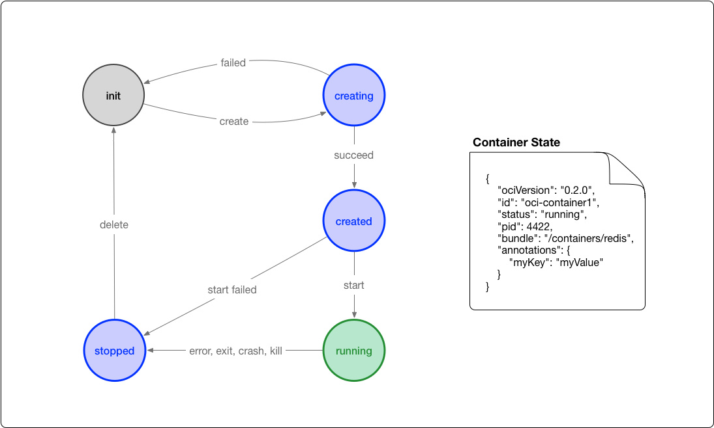

# 单机使用docker部署服务

docker并不一定非要自己构建镜像,很多时候docker生态是作为一种高效的分发工具而存在的.由于使用docker可以保证环境一致,这在本地开发调试中尤其常用.

## 单机容器部署的逻辑结构

docker单机容器部署的逻辑结构有2层,即

1. `container`容器,用于实际部署镜像执行任务
2. `stack`堆,用于描述一组互不相同的`container`的集合,比较接近命名空间的概念,只是在同一个stack下会有一些默认设置可以方便容器相互识别

这个模型基本上已经可以将常见的业务形态都包含进去了.

## docker的执行环境

docker的runtime就是docker执行容器的运行时,它必须满足一定的规范,我们安装好docker后已经有了一个默认的runtime,通常情况下这个runtime已经够用.

docker的runtime都是基于`linux`内核的,因此在windows上或者macos上执行docker实际都是使用的虚拟机.这都是通过集成环境`docker desktop`实现的安装.

### OCI中的`runtime spec`

docker的底层实际都是基于开源工具的(其实是docker开源出去的).具体来说就是两个工具

+ `containerd`一个用于管理容器从由镜像构建到执行结束整个生命周期的运行时
+ `runc`一个符合OCI标准的轻量级的通用容器运行时.

dockerd在构建容器时使用`containerd`,再由`containerd`调用`runc`等符合OCI标准的容器运行时.

OCI对容器runtime的标准主要是根据`runc`实现来定义的,它规范了容器的运行状态和runtime需要提供的命令.下图可以是容器状态转换图:



+ `creating`: 使用`create`命令创建容器,这个过程称为创建中.
+ `created`: 容器创建出来,但是还没有运行,表示镜像和配置没有错误,容器能够运行在当前平台.
+ `running`: 容器的运行状态,里面的进程处于up状态,正在执行用户设定的任务.
+ `stopped`：容器运行完成,或者运行出错,或者`stop`命令之后,容器处于暂停状态.这个状态容器还有很多信息保存在平台中.并没有完全被删除

这个状态我们也可以在`docker ps`中看到.

我们可以在[opencontainers/runtime-spec](https://github.com/opencontainers/runtime-spec/blob/master/implementations.md)中看到OCI官方认可的几个runtime.

另外还有几个值得关注的runtime.

+ [railcar](https://github.com/oracle/railcar)使用rust实现的runtime,主要优势是线程安全,不过已经不再维护
+ [Inclavare Containers](https://github.com/alibaba/inclavare-containers)阿里开源的面向机密计算场景的容器,主要优势是安全性
+ [nvidia-container-runtime](https://github.com/NVIDIA/nvidia-container-runtime)英伟达的runtime,使用它就可以调用gpu了.

这些都可以通过设置docker的配置项中的`runtimes`字段进行声明,然后在配置项中定义`default-runtime`定义默认运行时,不进行额外配置默认运行时就是`runc`.

一个典型的配置如:

```yaml
{
    "default-runtime":"runc",
    "runtimes": {
        "nvidia": {
            "path": "/usr/bin/nvidia-container-runtime",
            "runtimeArgs": []
        }
    }
}
```

我们也可以在启动docker镜像的时候使用`--runtime`指定使用什么运行时.

## 本地使用docker的工作流

单机部署docker容器的工作流有两种:

1. 使用`docker run`命令直接部署镜像
2. 使用`docker-compose`命令部署由`docker-compose.yml`编排的stack

由于第一种方式难以维护本文只介绍第二种方式.
