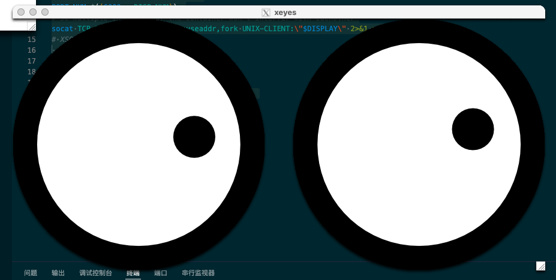

# docker中跑GUI应用

docker的GUI应用难点在于如何让容器中的gui可以在本地渲染,本地的操作可以传给容器中的应用.看到这里熟悉linux的朋友可能会想到一个词--`x11`.

没错了,x11作为linux上的古早桌面系统,拥有跨平台,兼容好的特点.虽然是个上古神器,但好就好在它在各个操作系统中都有对应的客户端工具.借助它我们就可以在docker中跑GUI应用了.而且理论上我们还可以将内容丢出来给外面其他的平台使用.

本文的例子在[docker-for-gui分支](https://github.com/hsz1273327/TutorialForDocker/tree/docker-for-gui)

## X11的原理

我们其实在前面介绍容器调用外设的时候已经简单用过X11,这里我会细致讲讲其中的细节.

X11可以理解为3个部分:

+ `X client`,即X11的客户端.通常是各类GUI应用,如Firefox、xterm、xclock等
+ `screen`,即逻辑概念上的`屏幕`.它可以是一台物理显示器,多台物理显示器或者是VNC虚拟显示器
+ `X server`,即X11的服务端,它负责管理`screen`以及机器上的显卡,鼠标,键盘等,管理输入信号和输出渲染

这三者的管理大致可以这样理解

+ `X client`负责指定要展示的`screen`,将GUI应用的展示部分以绘图指令的形式发送给`X server`
+ `X server`负责找到`X client`指定的`screen`,并将`X server`发来的绘图指令渲染成帧后转发给`screen`

这其中有几个要点

1. `X client`如何与`X server`连接?
2. `X client`如何指定屏幕?

这里就涉及到环境变量`DISPLAY`了

### 环境变量DISPLAY

`X client`如何连接`X server`并指定`screen`呢?就是靠这个环境变量

这个环境变量形式如下:

`[主机名]:<DISPLAY_NUM>[.<屏幕号>]`

其中主机名是可以忽略的,忽略的意思就是使用本机.而使用本机时就是走的`Unix-domain socket`通信;指定主机名时则使用的是`TCP`协议通信.

`DISPLAY_NUM`是一个人为定义的1000内的数,这个数的意义是用于区分`X client`连接的`X server`,毕竟一台机器上是允许有多个`X server`实例的.
当使用TCP协议时,它就对应`DISPLAY_NUM+6000`端口;当使用`Unix-domain socket`通信时则它会找本地socket文件`/tmp/.X11-unix/X<DISPLAY_NUM>`

`屏幕号`也就是`X server`上管理的`screen`的编号,不填则为`0`.

一般来说在linux中你的本地环境变量`DISPLAY`默认是`:0.0`

### ssh设置`X11Forwarding`

那如果我们希望调用远程机器上的gui应用那该怎么办呢?是不是让远端的`X client`通过TCP连本地的`X server`就好了?这个思路没错,而这其中的主要障碍就是如何让远端的`X client`能连上本地的`X server`.这种远程连接我们自然会想到`ssh`.思路就是:

1. 远端的`X client`连一个远端本地的TCP转发服务
2. 远端本地的TCP转发服务将连接转发给本地的`X server`
3. 本地`X server`再在本地做渲染做输入控制

这就是ssh的`X11Forwarding`功能.ssh会在使用`X11Forwarding`连接时做下面几件事

1. 本地拉起来一个`X server`,ssh会记下本地`X server`的端口
2. 远端拉起来一个TCP转发服务`localhost:6010`,将这个服务接收到消息都转发给本地`X server`的端口
3. 在远端连接建立起来的进程中设置环境变量`DISPLAY`为`localhost:10.0`.这个`10`是默认值,可以通过ssh参数`X11DisplayOffset`来设置

这样就都串上了.

那么怎么启用`X11Forwarding`呢?

+ 首先我们就需要本地有一个`X server`,linux中它是自带的,而windows和macos上我们就需要额外装对应的软件了.
+ 然后我们需要在远程端配置sshd--`/etc/ssh/sshd_config`

    ```txt
    X11Forwarding yes
    X11DisplayOffset 10
    PrintMotd no
    PrintLastLog yes
    TCPKeepAlive yes
    ```

这样,使用ssh(如果是macos或window则需要在支持X11的对应终端中执行)连接远程端后执行gui应用就可以在本地获得gui了.

这个思路其实也是我们在单机环境下用docker跑GUI应用的思路.

## 例子镜像

我们用一个最简单的例子来演示.下面是这个镜像的`dockerfile`

```dockerfile
FROM debian
RUN apt-get update
RUN apt-get install -qqy x11-apps
ENV DISPLAY :0
CMD xeyes
```

这个镜像我们就给他命名为`xeyes`好了

这个镜像安装了x11的几个应用,然后默认执行`xeyes`这个应用.这个GUI应用会展示两个眼睛,他们会跟随你的鼠标做动作.



## 在macos上用docker跑GUI应用

在macos上通过docker跑GUI应用我们需要做几个预备操作.

1. 安装[Xquartz](https://www.xquartz.org/)以获得`X server`.启动一次,然后重启机器,在进入terminal后我们可以检查下环境变量`DISPLAY`的值是否是类似`/private/tmp/com.apple.launchd.M7vTH5jpJs/org.xquartz:0`的形式.

2. 安装`socat`.由于macos的docker是跑在虚拟机里的,我们是无法直接使用`Unix-domain socket`通信的,那退而求其次我们就用TCP协议.我们需要让一个端口转发`X client`的消息到本地的的`Unix-domain socket`对应socket文件,这样链路就打通了.这个能力我们就可以借助`socat`.

    ```bash
    brew install socat
    ```

之后就是写一个脚本来启动我们的docker.比如就叫`runXeyes.sh`

```bash
#!/usr/bin/env bash
CONTAINER=xeyes

DISP_NUM=$(jot -r 1 100 200)  
PORT_NUM=$((6000 + DISP_NUM)) 
# 启动转发服务
socat TCP-LISTEN:${PORT_NUM},reuseaddr,fork UNIX-CLIENT:\"$DISPLAY\" 2>&1 > /dev/null &

docker run \
    --rm \
    -e DISPLAY=host.docker.internal:$DISP_NUM \
    $CONTAINER

# 回收转发服务
kill %1
```

之后需要使用的时候就进terminal.执行这个脚本即可.

```bash
bash runXeyes.sh
```

## 在windows上用docker跑GUI应用

windows上的docker一样跑在虚拟机里,因此也和macos上操作类似,我们需要先搞定x11环境,然后让容器可以走TCP协议访问本地x11环境的`X server`.

在macos上通过docker跑GUI应用我们需要做几个预备操作.

1. 安装[MobaXterm](https://mobaxterm.mobatek.net/)以获得`X server`,和macos中不同,X11是嵌在`MobaXterm`中的而不是嵌在系统里的,因此后续的操作我们需要全程在`MobaXterm`提供的shell里执行

2. 启动`MobaXterm`,进入`Settings -> X11(tab)`,设置`X11 Remote Access(X11远程访问)`为 `full`,并设置好`显示偏移量`(我这里默认用1).这样只要打开`MobaXterm`,容器就可以通过连接本地的`6001`端口访问本地`X server`了

之后我们需要的只是在容器的环境变量中指定`DISPLAY`为本地`6000`+`显示偏移量`即可.我们用如下脚本(`runXeyesInMobaXterm.sh`)

```bash
#!/usr/bin/env bash

CONTAINER=xeyes

# 获取当前本机的内网ip作为作为容器环境变量`DISPLAY`的host部分
# IPADDR=$(ifconfig $NIC | grep "inet " | awk '{print $2}')
# 100 - 200间找个随机数,作为容器环境变量`DISPLAY`的端口
DISP_NUM=1

docker run \
    --rm \
    -e DISPLAY=host.docker.internal:$DISP_NUM \
    $CONTAINER
```

要使用时先打开`MobaXterm`,然后执行这个脚本`bash runXeyesInMobaXterm.sh`即可

## 在linux上用docker跑GUI应用

由于linux上自带x11,而且docker是原生的并没有经过虚拟机,因此我们可以通过映射socket文件直接通过`Unix-domain socket`通信.

```bash
#!/usr/bin/env bash
CONTAINER=xeyes

docker run --rm \
    -e DISPLAY=$DISPLAY \
    -v /tmp/.X11-unix:/tmp/.X11-unix \
    $CONTAINER
```

当然了写个docker-compose也很简单

```yml
version: "2.4"
services:
    xeye:
        image: xeyes
        logging:
            options:
                max-file: "3"
                max-size: 10m
        environment:
            - DISPLAY=$DISPLAY
        volumes:
            - /tmp/.X11-unix:/tmp/.X11-unix     
```